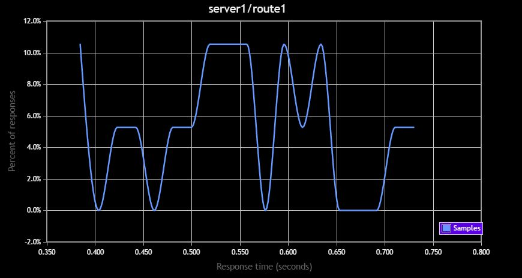

# AWS Lambda Benchmark

The purpose of this experiment is to benchmark AWS Lambda functions written in .NET and Node. I was interested in seeing if there was
any difference in spin-up time as well as any difference in overall response time.

The two different functions are set up the `node` and `dotnet` folders respectively. I used Visual Studio's built in Lambda 
deployment for the .NET function and used a lambda deployment package called [`serverless`](https://serverless.com/) to deploy the Node function.

## Test Procedure

I did not want to test the speed of the actual frameworks themselves, so each function just returns the word "Hello". This will
ensure that we are testing the actual speed of each of the deployed lambda functions.

Using a package called [`api-benchmark`](https://www.npmjs.com/package/api-benchmark) I was able to easily benchmark the two functions
at their corresponding routes. The results are generated by going to the benchmark folder and running `node benchmark.js`.

## Results
Here are a couple pictures in which we can interpret the results:

*.NET Results*

*Node Results*

As can be seen, the mean response time for the .NET function was about .54 whereas the mean response time for the Node function was about .58. This was surprising to me since I would have figured that the node function would have a much faster spin-up time than the .NET function.

Below are the response time distribution curves which might be useful for further analysis:

*.NET Results*

*Node Results*

## Conclusions

The reason for running this experiment was to see if creating a lambda function in .NET would have any significant impact on performance. As it turns out, the barebones .NET function actually responded faster than the barebones Node function. This means
that anyone who is thinking about creating .NET lambdas can be sure that their choice of language/framework will not have a 
performance hit (at least the barebones functions). I am not sure how .NET core compares to Node in terms of framework execution time,
but that might be analysis for another day.

## Future work

I wasn't quite able to get the number of responses to be what I wanted but I think that tinkering around more with the api-benchmark 
library would allow for a bit more conclusive evidence.
